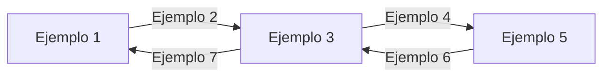

Quiero que me generes un markdown de presentación partiendo del Floan_Documentacion.md porque lo voy a usar para generar un pptx. Ese markdown de presentación tiene que cumplir:

### Referencia de sintaxis

| Sintaxis Markdown | Resultado en PowerPoint |
|---|---|
| `# Título` | **Portada** (layout 0): título, fecha mes/año y diagrama Mermaid opcional |
| `## Sección` | **Portada de sección** (layout 1): título en mayúsculas + número "01", "02"… y una slide de contenido vacía |
| `### Subtítulo` | En la **portada de sección**: se acumula como subtítulo. En el **contenido**: crea una nueva slide de contenido con ese texto como subtítulo |
| Texto normal | Párrafo sin viñeta en la slide de contenido actual |
| `* texto` o `- texto` | Viñeta (bullet point) en la slide de contenido actual |
| ` ```mermaid … ``` ` | Primer bloque → imagen en la portada. Bloques siguientes → imagen en la slide de contenido actual |
| `**texto**` o `__texto__` | **Negrita** |
| `*texto*` o `_texto_` | *Cursiva* |
| `~~texto~~` | ~~Tachado~~ |
| `` `texto` `` | `Código` (fuente Courier New) |

### Reglas de flujo

- Todo el contenido (texto, bullets, diagramas) va a la **slide de contenido activa**.
- Cada `## Sección` crea una portada de sección **y** una slide de contenido inicial.
- Cada `### Subtítulo` crea una **nueva slide de contenido** con ese subtítulo. Si aparece antes del primer contenido de una sección, también se añade a la portada de sección.
- Los bullets y textos van siempre a la slide de contenido activa en ese momento, **en el orden del Markdown**.


A continuación te pongo un markdown de ejemplo:


# Título de la presentación de ejemplo

Este es el primer bloque mermaid y aparecerá como imagen en la portada:



## Primera sección
### Introducción a la sección

Este es un texto normal dentro de la primera slide de contenido.
Aquí puede haber varias líneas de texto.

* Este es un bullet point
* **Este bullet tiene negrita**
* *Este bullet tiene cursiva*
* ~~Este bullet tiene tachado~~
* Este bullet tiene `codigo inline`

### Detalles de la sección

Texto normal debajo del segundo subtítulo.

* Otro bullet en la segunda slide de esta sección
* Con **palabras en negrita** y *palabras en cursiva* mezcladas

Debajo de los bullets puede haber más texto normal.

## Segunda sección
### Arquitectura del sistema

Texto descriptivo de la arquitectura.

El diagrama mermaid siguiente aparece como imagen:


### Flujo de datos

* Paso 1: El cliente envía la solicitud
* Paso 2: La solicitud se procesa
* Paso 3: Se consulta la base de datos
* Paso 4: Se devuelve la respuesta

Nota: los pasos anteriores pueden variar.

## Tercera sección

Esta sección no tiene subtítulos H3, solo bullets y texto.

Texto introductorio de la tercera sección.

* Objetivo 1: Automatizar el proceso
* Objetivo 2: Reducir tiempos de entrega
* Objetivo 3: Mejorar la calidad

Texto de cierre de la sección con **énfasis** en puntos clave.